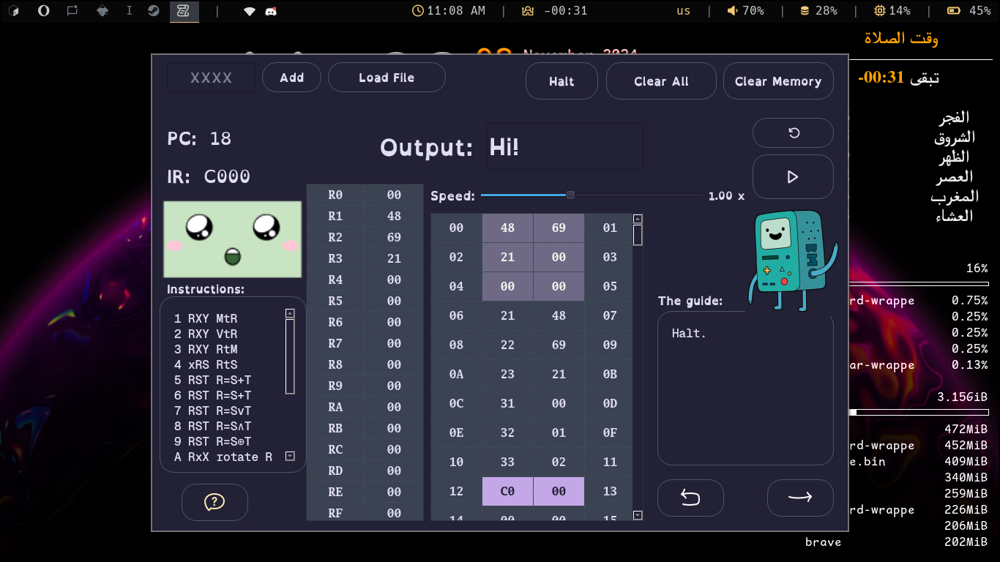

# ZMO - An interactive vole machine simulator made with C++ Qt6



youtube link showing the software: [Youtube video](https://youtu.be/WWo3SEs9rvE?si=DQyLCjWW8ydqhpBp)

# Avaliability
The software currently working on linux only
but if u want to open it u can use the source code and compile it on your machine or use docker
# How to use
1. Download the source code (Make sure u have qmake and make installed) 
```bash
sudo apt install build-essential qt5-qmake qtbase5-dev qtbase5-dev-tools qt4-qmake qtbase4-dev qtbase4-dev-tools
```
2. Open the terminal and navigate to the source code directory

3. Run the following commands:
```bash
git clone https://github.com/pxlman/vole-machine-simulator
cd vole-machine-simulator
qmake vole.pro
make
./vole
```
4. Enjoy using the software
# Key features
- Simple friendly easy to use UI.
- When holding on any key or highlighted item it shows you a tooltip for it.
- You can add instructions manually or by loading a file.
- You can see the memory/register data all the time and keep tracking their values.
- You can see the output as ASCII characters. The output is took from the first 6 cells in the memory.
- You can halt/completely end the program whenever you want.
- You can clear all the progress you done in the machine.
- You can clear all the memory cells with one click.
- You can rerun the last program you added.
- You can execute instructions one by one or by launching the whole program to execute them automatically. You can also change the speed of running.
- There always a guide there explaining the instruction that’s about to be executed.
- There is a guide to show you all the operation codes you can use that’s the vole machine understand. ( They are shorted to make it nicer for the UI).
- You can always see the current program counter and the instruction register to keep tracking the execution.
- ZMO is out there greeting you and be with you reacting to all your actions you must try playing with him yourself.
- The memory table shows you the current cells where the program counter is pointing to.
- The memory table highlight the screen cells.
- You can go forward or backward in running the application.

Give it a try 
